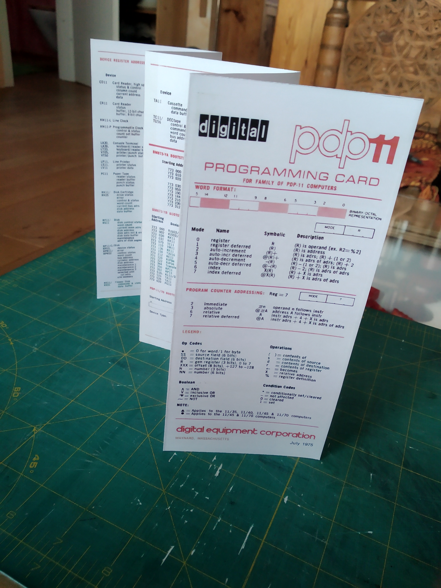

# My-PiDP
Stuff I create or collect while playing with my PiDP-11

* [PDP-11 Programming Card](#PDP-11 Programming Card)
* [License](#License)

Anything here that is my original work is licensed under the Creative Commons CC BY-SA license.

## PDP-11 Programming Card

The Programming Card is a quick reference for programming the machine. It includes a list of opcodes and listings for various versions of bootstrap loader code.

There are numerous scans of the original on the web. I have taken one published by Flickr-User Endogan and put it into a PDF ready for printing. My PDF is laid out for A4 paper and you can duplex-print two pages, take an exacto-knife to it, tape two parts together and fold it. I do not know the original dimensions and do not really care. After all my computer is not full size either.

## License

This means you are free to share and adapt.
 
The nature of the project entails that some material may legally be copyrighted by third parties. But I firmly believe that it is long past any commercial value and hope that nobody feels offended or damaged. If I am wrong and you are the holder of such copyright please tell me nicely.

