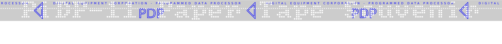

# My-PiDP
Stuff I create or collect while playing with my PiDP-11

The PiDP-11 is a modern replica of the PDP-11/70 computer in 6:10 scale. It is powered by a Raspberry Pi, unbelievably pretty and a ton of nerdy fun.

[PiDP-11 homepage](https://obsolescence.wixsite.com/obsolescence/pidp-11)

Find here:

* [PDP-11 Programming Card](#pdp-11-programming-card)
* [Tape2SVG](#tape-to-svg)
* [License](#license)

## PDP-11 Programming Card

The Programming Card is a quick reference for programming the machine. It includes a list of opcodes and listings for various versions of bootstrap loader code.

There are numerous scans of the original on the web. I have taken one published by Flickr-User [Endogan](https://www.flickr.com/photos/24989276@N00/albums/72157613479397758) and put it into a PDF ready for printing. My PDF is laid out for A4 paper and you can duplex-print two pages, take an exacto-knife to it, tape two parts together and fold it:

I do not know the original dimensions and do not really care. After all my PDP-11 is not full size either.

The download is provided in PDF format and as the ODG file which I created in Libre Office Draw.

* [programming_card.pdf](programming_card.pdf)
* [programming_card.odg](programming_card.odg)

## Tape To SVG

tape2svg.py is a little program that takes binary data from a file and "punches" a tape from it in the form of a SVG file. This file can then be viewed in a browser or printed out.

I do not have actual paper tape nor a punch and I am way too stingy to buy an "antique". So I thought I'd fake them.

The code is in a single python file with some very standard dependencies. There is nothing special about it and nothing clever. It just spits out text that can be read as SVG.

One nice feature is that it can also punch text to label tapes so you can create stickers or nametags as souvenirs:

## License

Anything here that is my original work is licensed under the Creative Commons CC BY-SA license.

In ultra brief terms this means you are free to share and adapt.
 
Where I used other people's work I have credited them to the best of my knowledge. If you feel left out please tell me, so I can fix that. 
 
The nature of the project entails that some material may legally be copyrighted by major third parties. I firmly believe that it is long past any commercial value and hope that nobody feels damaged. Should I be wrong about that and you are the holder of such copyright please don't be mad and tell me nicely.
